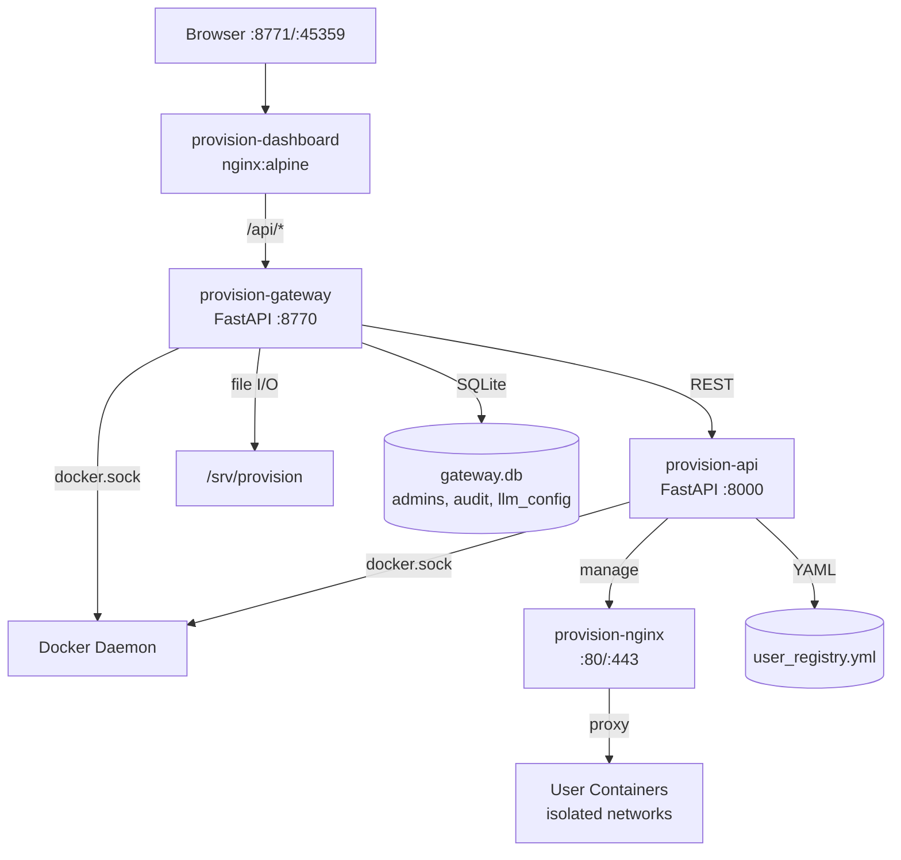

# Provision Gateway — Implementation Summary

> **Date**: 2026-07-03
> **Status**: Phase 1, 2, 4 Complete + Gap List Complete

---

## What Was Implemented

### Phase 1: Foundation ✅

**Gateway Backend** (`provision-gateway/`):
- `Dockerfile` — Python 3.13-slim with docker CLI, FastAPI + uvicorn
- `app/config.py` — Environment-based settings (PROVISION_DIR, secrets, URLs)
- `app/database.py` — SQLAlchemy + SQLite (gateway.db)
- `app/models/` — AdminUser, AuditLog, LLMConfig, ServiceTemplate, GatewaySetting
- `app/schemas/auth.py` — Pydantic request/response models
- `app/services/auth_service.py` — bcrypt password hashing, JWT create/decode
- `app/middleware/__init__.py` — JWT verification dependency
- `app/routers/auth.py` — /api/auth/setup, /register, /login, /refresh, /me, /password

**Dashboard Frontend** (`provision-dashboard/`):
- `Dockerfile` — Multi-stage: Node 20 build → nginx:alpine serve
- `nginx.conf` — SPA serve + /api/* proxy to gateway
- `package.json` — React 18, TypeScript, Ant Design 5, React Router, Axios, React Query
- `src/` — Login page, Setup wizard, App layout with sidebar, Dashboard page
- Placeholder pages: Services, Users, Tasks, Settings, Audit

### Phase 2: Core Operations ✅

**Gateway Backend**:
- `app/services/provision_service.py` — Async HTTP proxy to provision-api
- `app/services/audit_service.py` — Audit log CRUD with filtering
- `app/services/curl_service.py` — Async curl subprocess for URL testing
- `app/routers/users.py` — /api/users/* (list, deploy, remove, rebuild, password, url, test-curl, clone)
- `app/routers/tasks.py` — /api/tasks/* (list, get, cancel, log SSE streaming)
- `app/routers/audit.py` — /api/audit/* with filtering (admin_id, action, user, date range)

### Phase 4: Monitoring + Reconciliation ✅

**Gateway Backend**:
- `app/services/docker_service.py` — docker ps, stats, info, container checks
- `app/services/reconciliation.py` — Nginx upstream verification, state file management
- `app/utils/nginx_parser.py` — Parse nginx conf for server_name, proxy_pass
- `app/routers/system.py` — /api/system/status, /stats, /reconcile, /nginx-state

### Gap List: provision-api P1-P6 ✅

**Implemented in `_users_provision/`**:

| # | Feature | Implementation |
|---|---|---|
| P1 | Orphan network cleanup | `docker_ops.orphan_network_cleanup()` + called in `provisioner.remove_user()` |
| P2 | Build log streaming (SSE) | `GET /tasks/{task_id}/log?tail=N&follow=true` → SSE endpoint |
| P3 | Nginx connection state | `GET /nginx/connections` → networks, conf files, upstreams |
| P4 | Reconnect-all | `POST /nginx/reconnect-all` → reconnects nginx to all networks |
| P5 | Password change | `PUT /users/{user_name}/services/{service_name}/{label}/password` |
| P6 | Container logs | `GET /users/{user}/{service}/{label}/containers/{container}/logs` |

Added helper functions to `docker_ops.py`:
- `network_list()`, `network_inspect()`, `container_inspect()`
- `container_exists()`, `container_running()`
- `network_connected_to_container()`, `container_logs()`
- `orphan_network_cleanup()`

Added to `provisioner.py`:
- `change_password()` — re-hash, re-write htpasswd, update registry, reload nginx

---

## Design Changes Discovered

See [updated_design.md](./updated_design.md) for full details:

1. **PROVISION_API_URL default port**: Changed from `:8765` to `:8000` (container port vs host port)
2. **Docker network name**: `provision_default` → `users_provision_default`
3. **bcrypt library**: Using `bcrypt` directly instead of `passlib` due to bcrypt 5.0.0 incompatibility
4. **Docker CLI**: Added docker CLI binary to gateway container for docker commands

---

## Running Services

| Container | Port | Description |
|---|---|---|
| provision-api | :8765 (host), :8000 (internal) | User provisioning REST API |
| provision-nginx | :80/:443/:7687 | Reverse proxy for user services |
| provision-gateway | :8770 | Gateway backend API |
| provision-dashboard | :8771, :45359 | React SPA Web UI |

---

## Test Results

### Gateway Integration Tests: 9/9 passed
```
✓ Health check
✓ Auth setup
✓ Auth login
✓ Auth me
✓ Users proxy
✓ Tasks proxy
✓ Audit logs
✓ System status
✓ Unauthorized access rejected
```

---

## API Endpoints Summary

### Gateway (port 8770)

| Method | Path | Auth | Description |
|---|---|---|---|
| GET | /health | No | Health check |
| POST | /api/auth/setup | No | First-run admin creation |
| POST | /api/auth/register | Admin | Create admin user |
| POST | /api/auth/login | No | Login, get JWT |
| POST | /api/auth/refresh | No | Refresh access token |
| GET | /api/auth/me | Yes | Current admin profile |
| PUT | /api/auth/password | Yes | Change password |
| GET | /api/system/status | Yes | System health + Docker stats |
| GET | /api/system/stats | Yes | Per-container metrics |
| POST | /api/system/reconcile | Yes | Run nginx reconciliation |
| GET | /api/system/nginx-state | Yes | Get nginx state JSON |
| GET | /api/users | Yes | List end-users (proxied) |
| GET | /api/users/{name} | Yes | Get user's services |
| POST | /api/users/deploy | Yes | Deploy service to user |
| DELETE | /api/users/{u}/{s}/{l} | Yes | Remove user service |
| POST | /api/users/{u}/{s}/{l}/rebuild | Yes | Rebuild service |
| PUT | /api/users/{u}/{s}/{l}/password | Yes | Change user password |
| GET | /api/users/{u}/{s}/{l}/url | Yes | Get service URL |
| POST | /api/users/{u}/{s}/{l}/test-curl | Yes | Test curl service URL |
| POST | /api/users/clone | Yes | Clone user services |
| GET | /api/tasks | Yes | List tasks |
| GET | /api/tasks/{id} | Yes | Get task status |
| DELETE | /api/tasks/{id} | Yes | Cancel task |
| GET | /api/tasks/{id}/log | Yes | SSE log stream |
| GET | /api/audit | Yes | Query audit logs |
| GET | /api/services | Yes | List service projects |
| GET | /api/llm/config | Yes | Get LLM config |

### provision-api New Endpoints (from gap list)

| Method | Path | Description |
|---|---|---|
| GET | /tasks/{id}/log | SSE build log streaming |
| GET | /nginx/connections | Nginx network + upstream state |
| POST | /nginx/reconnect-all | Reconnect nginx to all networks |
| PUT | /users/{u}/services/{s}/{l}/password | Change user password |
| GET | /users/{u}/services/{s}/{l}/containers/{c}/logs | Container logs |

---

## Remaining Work (Phase 3)

- Service project management (git clone, file upload, template conversion)
- LLM integration (OpenAI-compatible client, config generation)
- File scanner for repo analysis
- Crypto utility (AES-256-GCM for BYOK key encryption)
- Service templates CRUD
- Dashboard enhancements (Service detail page, file editor, deploy form, log viewer)

---

## Architecture



## Quick Start

```bash
# Start provision stack (if not running)
cd _users_provision
docker compose -f docker-compose.provision.yml up -d

# Start gateway stack
cd _provision_gateway
docker compose -f docker-compose.gateway.yml up -d

# Access dashboard
open http://localhost:8771
# or
open http://localhost:45359
```
