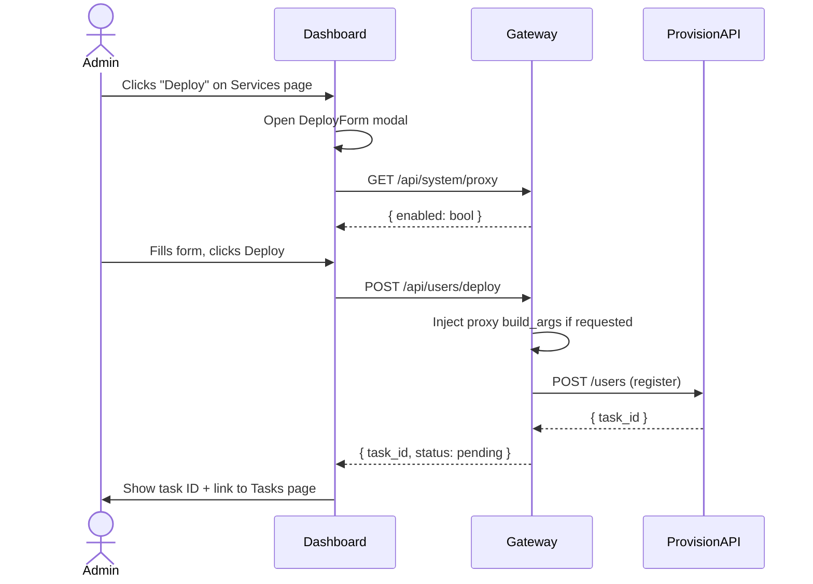

# Deploy Form Feature

> **Created**: 2026-07-04
> **Status**: In Progress
> **Design ref**: [design.md §6.3 — Deploy to User Form](../design.md)

---

## Purpose

A modal form in the dashboard that allows admins to deploy a service project
(source project) to an end-user. This is the primary user-facing flow for
provisioning services.

## Design Spec

From `design.md`:

```
┌──────────────────────────────────────────────┐
│  Deploy: myapp → alice                       │
│  User Name, Label, Domain, Password           │
│  ☑ Enable HTTPS (fullchain/privkey)           │
│  Volume Mapping (dynamic)                     │
│  Build Args (dynamic)                         │
│  ☐ Use global proxy (disabled if proxy off)   │
│  [Cancel]  [🚀 Deploy]                        │
└──────────────────────────────────────────────┘
```

## Implementation

### Components

- `src/components/services/DeployForm.tsx` — reusable modal component
- `src/pages/UsersPage.tsx` — updated with "Deploy" button per service

### API

- `POST /api/users/deploy` — already implemented
- `GET /api/system/proxy` — used to check if global proxy is enabled

### Flow



## Tests

| Layer | File | Scope |
|---|---|---|
| Unit | `tests/test_deploy_form.py` | DeployForm rendering, form validation |
| E2E | `tests/test_e2e_deploy.py` | Full deploy flow with mocked API |
| Integration | `tests/test_deploy.sh` | Real deploy via API against provision-api |

## Changelog

| Date | Change |
|---|---|
| 2026-07-04 | Initial creation |
